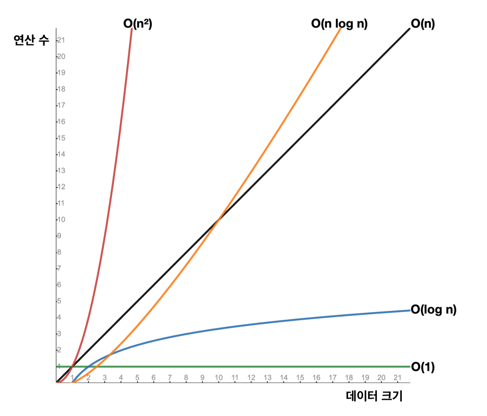

# 컬렉션 프레임워크

## 빅오(O) 표기법
* 알고리즘 성능 분석 시 사용하는 수학적 표기 방식으로, 알고리즘이 처리해야 할 데이터 양이 증가할 때 그 알고리즘이 얼마나 빠르게 실행되는지 나타냄
* 빅오 표기법 예시
  * O(1): 상수 시간: 입력 데이터의 크기와 관계 없이 알고리즘의 실행시간이 일정함
  * O(n): 선형 시간: 알고리즘의 실행 시간이 입력 데이터의 크기에 비례함
  * O(n^2): 제곱 시간: 알고리즘의 실행 시간이 입력 데이터 크기의 제곱에 비례하여 증가함
  * O(log n): 로그 시간: 알고리즘의 실행 시간이 데이터 크기의 로그에 비례하여 증가함
  * O(n log n): 선형 로그 시간 

